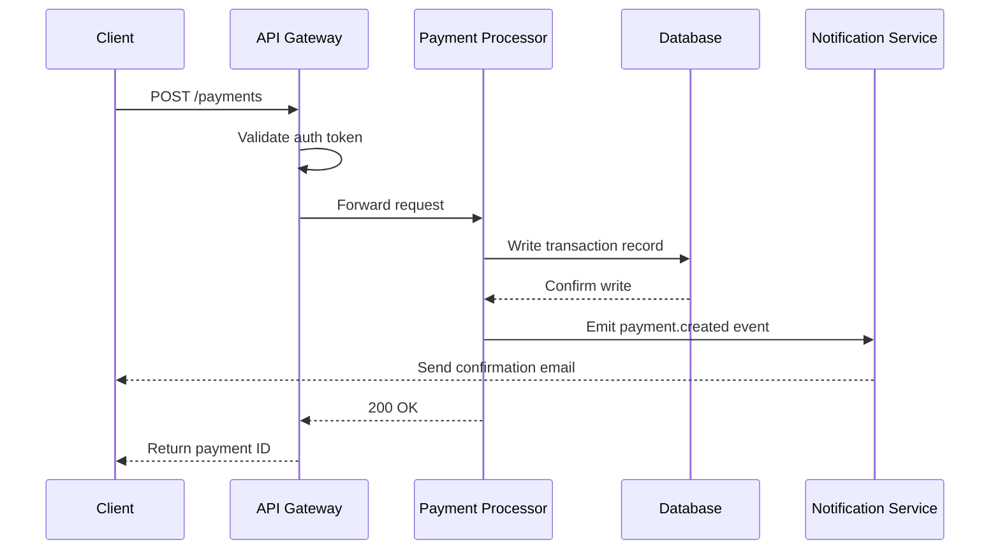
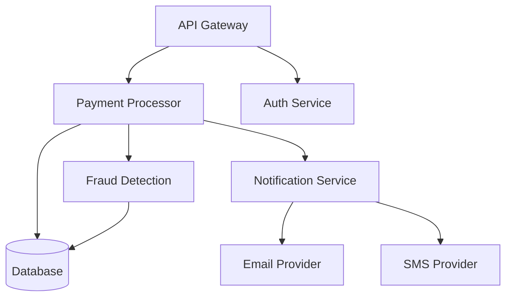
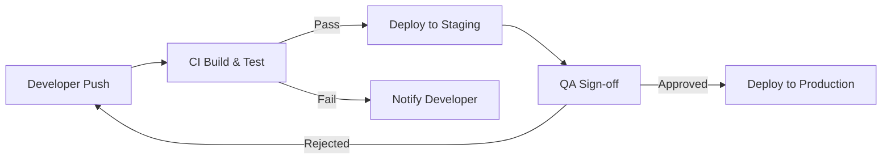

# Architecture Overview

This document describes the system architecture for the **Payments Platform**.

---

## Components

The platform consists of three primary services: the API Gateway, the Payment Processor,
and the Notification Service.

| Component            | Language | Owner         |
| -------------------- | -------- | ------------- |
| API Gateway          | Node.js  | Platform team |
| Payment Processor    | Go       | Payments team |
| Notification Service | Python   | Comms team    |

---

## Request Flow

The following diagram shows how a payment request moves through the system.



---

## Service Dependencies



---

## Deployment Pipeline



---

## Code Example

The Gateway forwards requests using a simple retry wrapper:

```
func forwardWithRetry(req *PaymentRequest, maxRetries int) (*PaymentResponse, error) {
    for i := 0; i < maxRetries; i++ {
        resp, err := processorClient.Send(req)
        if err == nil {
            return resp, nil
        }
        time.Sleep(backoff(i))
    }
    return nil, ErrMaxRetriesExceeded
}
```

## Notes

- All inter-service communication uses **mTLS**
- The database is write-ahead logged with a **30-day retention** window
- Fraud Detection runs asynchronously and does **not** block the payment response
